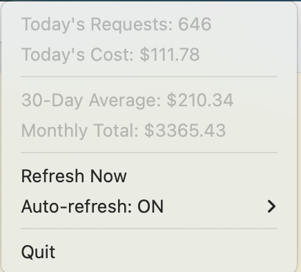

# Claude Usage Tracker

Track your Claude Code usage and see what it would cost on API pricing. Get insights into your AI coding productivity with beautiful ASCII charts and real-time cost analysis.


## ✨ Features

- **💰 Cost Analysis**: See what your usage would cost on API pay-as-you-go pricing vs Claude Code Max ($100/month)
- **📊 Beautiful ASCII Charts**: Visualize your daily usage patterns over the last 30 days
- **🤖 Model Breakdown**: Track usage by model (Sonnet 4, Opus 4, etc.)
- **📈 Projections**: Daily and monthly cost estimates based on your usage
- **🖥️ Menu Bar Widget**: Real-time usage display in macOS menu bar
- **🔧 Zero Dependencies**: Uses only Python standard library
- **⚡ Fast**: Analyzes thousands of conversations in seconds

## 🚀 Quick Start

### Installation

```bash
# Clone the repository
git clone https://github.com/andybowu/claude-usage-tracker.git
cd claude-usage-tracker

# Run the tracker
python3 claude_usage_tracker.py

# Or install the handy alias
echo 'alias cu="python3 $(pwd)/claude_usage_tracker.py"' >> ~/.zshrc
source ~/.zshrc

# Now just type:
cu
```

### What You'll See

```
💰 CLAUDE CODE USAGE SUMMARY
========================================

📊 USAGE (30 days):
  Total requests: 18,186
  Total tokens: 71,680,667

💵 COSTS:
  API equivalent: $951.49
  Your cost: $100.00 (Max plan)
  You saved: $851.49

📈 PROJECTIONS:
  Daily average: $105.72
  Monthly estimate: $3,171.64

🤖 MODEL USAGE:
  Claude Sonnet 4: 15,388 requests → $578.32
  Claude Opus 4: 2,763 requests → $373.17
  <synthetic>: 35 requests → $0.00

📅 RECENT ACTIVITY:

  📊 Activity Chart (max: 3,646 requests)
  ─────────────────────────────────────────────────────────────────
  06-07 │█████████████████████████████                     │ 2,164
  06-08 │███████████████████████████████████████           │ 2,911
  06-09 │██████████████████████████████████████████████████│ 3,646
  06-10 │█████████████████████████████                     │ 2,124
  06-11 │█████████████████████████████████████████████     │ 3,307
  06-12 │████████████████████████████████████              │ 2,689
  06-13 │█████████████                                     │ 1,001
  06-14 │██                                                │ 215
  06-15 │█                                                 │ 129
  ─────────────────────────────────────────────────────────────────
```

## 🎯 Use Cases

- **Budget Planning**: Understand if Claude Code Max subscription saves you money
- **Usage Optimization**: Identify peak usage days and patterns
- **Team Insights**: Track team-wide Claude usage (if sharing logs)
- **Cost Allocation**: Understand costs per project or time period

## 📱 Menu Bar Widget (macOS)

<details>
<summary>Show real-time usage in your menu bar</summary>



```bash
# Start the menu bar widget
python3 claude_menu_bar.py

# Or use the convenience script
./start_menu_bar.sh
```

The widget shows:
- Daily token count
- Equivalent API cost
- Updates every 30 seconds
- Minimal resource usage

### Auto-start on Login

To have the menu bar widget start automatically when you log in:

**Method 1: Using LaunchAgent (Recommended)**

1. Create a LaunchAgent plist file:
```bash
mkdir -p ~/Library/LaunchAgents
cat > ~/Library/LaunchAgents/com.claude.usage-tracker.plist << 'EOF'
<?xml version="1.0" encoding="UTF-8"?>
<!DOCTYPE plist PUBLIC "-//Apple//DTD PLIST 1.0//EN" "http://www.apple.com/DTDs/PropertyList-1.0.dtd">
<plist version="1.0">
<dict>
    <key>Label</key>
    <string>com.claude.usage-tracker</string>
    <key>ProgramArguments</key>
    <array>
        <string>/usr/bin/python3</string>
        <string>/Users/YOUR_USERNAME/claude-usage-tracker/claude_menu_bar.py</string>
    </array>
    <key>RunAtLoad</key>
    <true/>
    <key>KeepAlive</key>
    <false/>
</dict>
</plist>
EOF
```

2. Replace `/Users/YOUR_USERNAME/claude-usage-tracker` with your actual path
3. Load the LaunchAgent:
```bash
launchctl load ~/Library/LaunchAgents/com.claude.usage-tracker.plist
```

To unload: `launchctl unload ~/Library/LaunchAgents/com.claude.usage-tracker.plist`

**Method 2: Using Login Items**

1. Open System Settings → General → Login Items
2. Click the + button under "Open at Login"
3. Navigate to your `start_menu_bar.sh` script
4. Select it and click Open

**Method 3: Using a Startup App**

Create an Automator app:
1. Open Automator and create a new Application
2. Add a "Run Shell Script" action
3. Enter: `/path/to/your/claude-usage-tracker/start_menu_bar.sh`
4. Save as "Claude Usage Tracker.app"
5. Add to Login Items as in Method 2

</details>

## 🛠 Advanced Usage

### Command Line Options

```bash
# Show JSON output
cu --json

# Filter by date range
cu --start-date 2025-01-01 --end-date 2025-01-14

# Specify custom Claude directory
cu --claude-dir /path/to/.claude

# Export to CSV (coming soon)
cu --export usage-report.csv
```

### Tmux Integration

<details>
<summary>Add Claude usage to your tmux status bar</summary>

```bash
# Add to ~/.tmux.conf
set -g status-right '#(~/claude-usage-tracker/claude_tmux_status.sh) | %H:%M'
```

See [tmux_setup.md](tmux_setup.md) for detailed instructions.

</details>

## 📊 How It Works

1. **Reads** your local Claude Code conversation logs from `~/.claude/projects/`
2. **Parses** the JSON to extract token usage per conversation
3. **Calculates** costs based on current API pricing
4. **Compares** with Claude Code Max subscription ($100/month)
5. **Visualizes** usage patterns with ASCII charts

The tool is read-only and doesn't modify any files or send data anywhere.

## 🔒 Privacy

- All analysis happens locally on your machine
- No data is sent to external servers
- No telemetry or analytics
- Completely open source

## 📋 Requirements

- Python 3.6 or higher
- Claude Code installed with conversation logs in `~/.claude/projects/`
- No external Python dependencies! 

### Optional Requirements

- macOS: For menu bar widget functionality
- `rumps`: Only if using the menu bar widget (`pip install rumps`)

## 🤝 Contributing

Contributions are welcome! Areas for improvement:

- **Export Features**: Add CSV/JSON export functionality
- **Web Dashboard**: Create a web interface for usage visualization
- **Windows/Linux Widgets**: Port menu bar functionality
- **Performance**: Optimize for very large conversation histories
- **Analytics**: Add more detailed usage analytics

Please read [CONTRIBUTING.md](CONTRIBUTING.md) for details.

## 📄 License

This project is licensed under the MIT License - see the [LICENSE](LICENSE) file for details.

## 🙏 Acknowledgments

- Built for the Claude Code community
- Inspired by the need to understand AI tool costs
- Thanks to all contributors and testers

## 📚 Related Projects

- [Claude Code Documentation](https://docs.anthropic.com/en/docs/claude-code)
- [Awesome MCP Servers](https://github.com/punkpeye/awesome-mcp-servers)

---

<p align="center">
Made with ❤️ for the Claude Code community
<br>
If this tool saves you money, consider starring ⭐ the repo!
</p>
